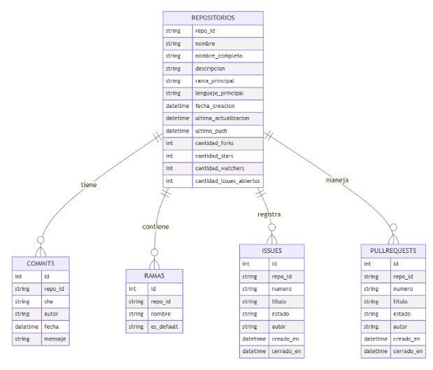
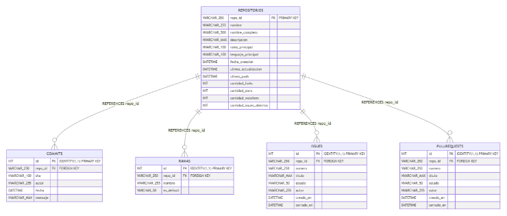



**UNIVERSIDAD PRIVADA DE TACNA**

**FACULTAD DE INGENIERÍA**

**Escuela Profesional de Ingeniería de Sistemas**

**Informe Final** 
**\

**Dashboard de Monitoreo de Repositorios Académicos en GitHub: Tendencias en Desarrollo y Gestión de Proyectos de los estudiantes en la facultad de Ingeniería de Sistemas**

Curso: Inteligencia de Negocios

Docente: Patrick Cuadros Quiroga

Integrantes:

***Chambi Cori, Jerson Roni			(2021072619)***

***Flores Quispe, Jaime Elias			(2021070309)***

***Leyva Sardon, Elvis Ronald		(2021072614)***

**Tacna – Perú**

***2025***

**Dashboard de Monitoreo de Repositorios Académicos en GitHub: Tendencias en Desarrollo y Gestión de Proyectos de los estudiantes en la facultad de Ingeniería de Sistemas**

**Diccionario de Datos**

**Versión *1.0***

**ÍNDICE GENERAL**

[**1. Modelo Entidad / relación	4**](#_heading=h.30j0zll)

[1.1. Diseño lógico	4](#_heading=h.1fob9te)

[**2. Diccionario de datos	5**](#_heading=h.tyjcwt)

[2.1. Tablas	5](#_heading=h.3dy6vkm)

[2.2. Lenguaje de Definición de Datos (DDL)	9](#_heading=h.3dy6vkm)

[2.2.1. CREATE DATABASE y USE	9](#_heading=h.um1q7rhcr2un)

[2.2.2. CREATE TABLE	9](#_heading=h.um1q7rhcr2un)

[2.3. Lenguaje de Manipulación de Datos (DML)	11](#_heading=h.3dy6vkm)

[2.3.1. Ejemplos de INSERT	11](#_heading=h.1c2zeuneqwyb)

[2.3.2. Ejemplos de SELECT para métricas	11](#_heading=h.dgid5jcoj5qs)

**Diccionario de Datos**

1. # **Modelo Entidad / relación**
   1. ## **Diseño lógico**

1. **Diseño Físico**

1. # **Diccionario de datos**
   1. ## **Tablas**
**Tabla 1: Repositorios**

|**Nombre de la Tabla:**|Repositorios|
| :- | :- |
|**Descripción de la Tabla:**|Almacena información principal de los repositorios de código|
|**Objetivo:**|Mantener el registro maestro de todos los repositorios con sus características principales|
|**Relaciones con otras Tablas:**|Tabla padre de Commits, Ramas, Issues y PullRequests|

**Descripción de los campos:**

|**Nro.**|**Nombre del campo**|**Tipo dato**|**Longitud**|**Permite nulos**|**Clave primaria**|**Clave foránea**|**Descripción del campo**|
| :-: | :-: | :-: | :-: | :-: | :-: | :-: | :-: |
|1|repo\_id|VARCHAR|250|NO|SÍ|NO|Identificador único del repositorio|
|2|nombre|NVARCHAR|255|SÍ|NO|NO|Nombre corto del repositorio|
|3|nombre\_completo|NVARCHAR|500|SÍ|NO|NO|Nombre completo del repositorio incluyendo propietario|
|4|descripcion|NVARCHAR|MAX|SÍ|NO|NO|Descripción detallada del repositorio|
|5|rama\_principal|NVARCHAR|100|SÍ|NO|NO|Nombre de la rama principal (main/master)|
|6|lenguaje\_principal|NVARCHAR|100|SÍ|NO|NO|Lenguaje de programación predominante|
|7|fecha\_creacion|DATETIME|-|SÍ|NO|NO|Fecha y hora de creación del repositorio|
|8|ultima\_actualizacion|DATETIME|-|SÍ|NO|NO|Fecha y hora de la última actualización|
|9|ultimo\_push|DATETIME|-|SÍ|NO|NO|Fecha y hora del último push realizado|
|10|cantidad\_forks|INT|-|SÍ|NO|NO|Número total de forks del repositorio|
|11|cantidad\_stars|INT|-|SÍ|NO|NO|Número total de estrellas recibidas|
|12|cantidad\_watchers|INT|-|SÍ|NO|NO|Número total de usuarios siguiendo el repositorio|
|13|cantidad\_issues\_abiertos|INT|-|SÍ|NO|NO|Número de issues actualmente abiertos|

**Tabla 2: Commits**

|**Nombre de la Tabla:**|Commits|
| :- | :- |
|**Descripción de la Tabla:**|Registra todos los commits realizados en los repositorios|
|**Objetivo:**|Mantener un historial completo de todos los commits por repositorio|
|**Relaciones con otras Tablas:**|Relacionada con Repositorios mediante repo\_id|

**Descripción de los campos:**

|**Nro.**|**Nombre del campo**|**Tipo dato**|**Longitud**|**Permite nulos**|**Clave primaria**|**Clave foránea**|**Descripción del campo**|
| :-: | :-: | :-: | :-: | :-: | :-: | :-: | :-: |
|1|id|INT|-|NO|SÍ|NO|Identificador único autoincremental del commit|
|2|repo\_id|VARCHAR|250|NO|NO|SÍ|Referencia al repositorio (FK a Repositorios)|
|3|sha|NVARCHAR|100|SÍ|NO|NO|Hash único del commit en Git|
|4|autor|NVARCHAR|255|SÍ|NO|NO|Nombre del autor del commit|
|5|fecha|DATETIME|-|SÍ|NO|NO|Fecha y hora del commit|
|6|mensaje|NVARCHAR|MAX|SÍ|NO|NO|Mensaje descriptivo del commit|

**Tabla 3: Ramas**

|**Nombre de la Tabla:**|Ramas|
| :- | :- |
|**Descripción de la Tabla:**|Almacena información de las ramas de cada repositorio|
|**Objetivo:**|Gestionar las diferentes ramas de desarrollo por repositorio|
|**Relaciones con otras Tablas:**|Relacionada con Repositorios mediante repo\_id|

**Descripción de los campos:**

|**Nro.**|**Nombre del campo**|**Tipo dato**|**Longitud**|**Permite nulos**|**Clave primaria**|**Clave foránea**|**Descripción del campo**|
| :-: | :-: | :-: | :-: | :-: | :-: | :-: | :-: |
|1|id|INT|-|NO|SÍ|NO|Identificador único autoincremental de la rama|
|2|repo\_id|VARCHAR|250|NO|NO|SÍ|Referencia al repositorio (FK a Repositorios)|
|3|nombre|NVARCHAR|255|SÍ|NO|NO|Nombre de la rama|
|4|es\_default|VARCHAR|50|SÍ|NO|NO|Indica si es la rama principal (true/false)|

**Tabla 4: Issues**

|**Nombre de la Tabla:**|Issues|
| :- | :- |
|**Descripción de la Tabla:**|Registra los issues (problemas/tareas) de cada repositorio|
|**Objetivo:**|Gestionar el seguimiento de problemas y tareas pendientes|
|**Relaciones con otras Tablas:**|Relacionada con Repositorios mediante repo\_id|

**Descripción de los campos:**

|**Nro.**|**Nombre del campo**|**Tipo dato**|**Longitud**|**Permite nulos**|**Clave primaria**|**Clave foránea**|**Descripción del campo**|
| :-: | :-: | :-: | :-: | :-: | :-: | :-: | :-: |
|1|id|INT|-|NO|SÍ|NO|Identificador único autoincremental del issue|
|2|repo\_id|VARCHAR|250|NO|NO|SÍ|Referencia al repositorio (FK a Repositorios)|
|3|numero|VARCHAR|250|SÍ|NO|NO|Número del issue en el repositorio|
|4|titulo|NVARCHAR|MAX|SÍ|NO|NO|Título descriptivo del issue|
|5|estado|NVARCHAR|50|SÍ|NO|NO|Estado actual del issue (open/closed)|
|6|autor|NVARCHAR|255|SÍ|NO|NO|Usuario que creó el issue|
|7|creado\_en|DATETIME|-|SÍ|NO|NO|Fecha y hora de creación del issue|
|8|cerrado\_en|DATETIME|-|SÍ|NO|NO|Fecha y hora de cierre del issue|

**Tabla 5: PullRequests**

|**Nombre de la Tabla:**|PullRequests|
| :- | :- |
|**Descripción de la Tabla:**|Registra las solicitudes de fusión de código|
|**Objetivo:**|Gestionar las propuestas de cambios y su proceso de revisión|
|**Relaciones con otras Tablas:**|Relacionada con Repositorios mediante repo\_id|

**Descripción de los campos:**

|**Nro.**|**Nombre del campo**|**Tipo dato**|**Longitud**|**Permite nulos**|**Clave primaria**|**Clave foránea**|**Descripción del campo**|
| :-: | :-: | :-: | :-: | :-: | :-: | :-: | :-: |
|1|id|INT|-|NO|SÍ|NO|Identificador único autoincremental del pull request|
|2|repo\_id|VARCHAR|250|NO|NO|SÍ|Referencia al repositorio (FK a Repositorios)|
|3|numero|VARCHAR|250|SÍ|NO|NO|Número del pull request en el repositorio|
|4|titulo|NVARCHAR|MAX|SÍ|NO|NO|Título descriptivo del pull request|
|5|estado|NVARCHAR|50|SÍ|NO|NO|Estado actual del PR (open/closed/merged)|
|6|autor|NVARCHAR|255|SÍ|NO|NO|Usuario que creó el pull request|
|7|creado\_en|DATETIME|-|SÍ|NO|NO|Fecha y hora de creación del PR|
|8|cerrado\_en|DATETIME|-|SÍ|NO|NO|Fecha y hora de cierre del PR|

**Tabla 6: ResumenMetricas**

|**Nombre de la Tabla:**|ResumenMetricas|
| :- | :- |
|**Descripción de la Tabla:**|Almacena métricas consolidadas del sistema|
|**Objetivo:**|Proporcionar información estadística general del sistema|
|**Relaciones con otras Tablas:**|Tabla independiente con datos calculados|

**Descripción de los campos:**

|**Nro.**|**Nombre del campo**|**Tipo dato**|**Longitud**|**Permite nulos**|**Clave primaria**|**Clave foránea**|**Descripción del campo**|
| :-: | :-: | :-: | :-: | :-: | :-: | :-: | :-: |
|1|total\_repositorios|INT|-|SÍ|NO|NO|Cantidad total de repositorios en el sistema|
|2|total\_commits|INT|-|SÍ|NO|NO|Cantidad total de commits en todos los repositorios|
|3|promedio\_commits\_por\_repo|DECIMAL|10,2|SÍ|NO|NO|Promedio de commits por repositorio|
1. ## **Lenguaje de Definición de Datos (DDL)**
   1. ### **CREATE DATABASE y USE**

      CREATE DATABASE SistemaRepositoriosGit;

      USE SistemaRepositoriosGit;
   1. ### **CREATE TABLE**

**Crear tabla Repositorios si no existe**

IF NOT EXISTS (SELECT \* FROM sys.tables WHERE name = 'Repositorios')

BEGIN

`    `CREATE TABLE Repositorios (

`        `repo\_id VARCHAR(250) PRIMARY KEY,  -- SIN IDENTITY

`        `nombre NVARCHAR(255),

`        `nombre\_completo NVARCHAR(500),

`        `descripcion NVARCHAR(MAX),

`        `rama\_principal NVARCHAR(100),

`        `lenguaje\_principal NVARCHAR(100),

`        `fecha\_creacion DATETIME,

`        `ultima\_actualizacion DATETIME,

`        `ultimo\_push DATETIME,

`        `cantidad\_forks INT,

`        `cantidad\_stars INT,

`        `cantidad\_watchers INT,

`        `cantidad\_issues\_abiertos INT

`    `);

END

**Crear tabla Commits si no existe**

IF NOT EXISTS (SELECT \* FROM sys.tables WHERE name = 'Commits')

BEGIN

`    `CREATE TABLE Commits (

`        `id INT IDENTITY(1,1) PRIMARY KEY,

`        `repo\_id VARCHAR(250) FOREIGN KEY REFERENCES Repositorios(repo\_id),

`        `sha NVARCHAR(100),

`        `autor NVARCHAR(255),

`        `fecha DATETIME,

`        `mensaje NVARCHAR(MAX)

`    `);

END

**Crear tabla Ramas si no existe**

IF NOT EXISTS (SELECT \* FROM sys.tables WHERE name = 'Ramas')

BEGIN

`    `CREATE TABLE Ramas (

`        `id INT IDENTITY(1,1) PRIMARY KEY,

`        `repo\_id VARCHAR(250) FOREIGN KEY REFERENCES Repositorios(repo\_id),

`        `nombre NVARCHAR(255),

`        `es\_default VARCHAR(50)

`    `);

END

**Crear tabla Issues si no existe**

IF NOT EXISTS (SELECT \* FROM sys.tables WHERE name = 'Issues')

BEGIN

`    `CREATE TABLE Issues (

`        `id INT IDENTITY(1,1) PRIMARY KEY,

`        `repo\_id VARCHAR(250) FOREIGN KEY REFERENCES Repositorios(repo\_id),

`        `numero VARCHAR(250),

`        `titulo NVARCHAR(MAX),

`        `estado NVARCHAR(50),

`        `autor NVARCHAR(255),

`        `creado\_en DATETIME,

`        `cerrado\_en DATETIME

`    `);

END

**Crear tabla PullRequests si no existe**

IF NOT EXISTS (SELECT \* FROM sys.tables WHERE name = 'PullRequests')

BEGIN

`    `CREATE TABLE PullRequests (

`        `id INT IDENTITY(1,1) PRIMARY KEY,

`        `repo\_id VARCHAR(250) FOREIGN KEY REFERENCES Repositorios(repo\_id),

`        `numero VARCHAR(250),

`        `titulo NVARCHAR(MAX),

`        `estado NVARCHAR(50),

`        `autor NVARCHAR(255),

`        `creado\_en DATETIME,

`        `cerrado\_en DATETIME

`    `);

END

**Crear tabla ResumenMetricas si no existe**

IF NOT EXISTS (SELECT \* FROM sys.tables WHERE name = 'ResumenMetricas')

BEGIN

`    `CREATE TABLE ResumenMetricas (

`        `total\_repositorios INT,

`        `total\_commits INT,

`        `promedio\_commits\_por\_repo DECIMAL(10,2)

`    `);

END
1. ## **Lenguaje de Manipulación de Datos (DML)**
   1. ###  **Ejemplos de INSERT**

**Insertando datos para la tabla Repositorios:**

IF NOT EXISTS (SELECT 1 FROM Repositorios WHERE repo\_id = '402589689')

    INSERT INTO Repositorios (repo\_id, nombre, nombre\_completo, descripcion, rama\_principal, lenguaje\_principal, fecha\_creacion, ultima\_actualizacion, ultimo\_push, cantidad\_forks, cantidad\_stars, cantidad\_watchers, cantidad\_issues\_abiertos) 

    VALUES ('402589689', 'trabajo\_grupal\_01\_u1-grupo\_valdez\_poma\_yucra\_sagua\_romero', 'UPT-FAING-EPIS/trabajo\_grupal\_01\_u1-grupo\_valdez\_poma\_yucra\_sagua\_romero', 'trabajo\_grupal\_01\_u1-grupo\_valdez\_poma\_yucra\_sagua\_romero created by GitHub Classroom', 'main', '', '2021-09-02 23:32:47', '2021-09-02 23:32:51', '2021-09-02 23:47:41', 0, 0, 0, 0);

**Insertando datos para la tabla Commits:**

IF NOT EXISTS (SELECT 1 FROM Commits WHERE sha = 'ee13a0a4ae685a0fced354f783ed283bc038e8cc')

    INSERT INTO Commits (repo\_id, sha, autor, fecha, mensaje) 

    VALUES ('627696698', 'ee13a0a4ae685a0fced354f783ed283bc038e8cc', 'dobby07', '2023-04-25 16:31:34', 'BB');

**Insertando datos para la tabla Ramas:**

IF NOT EXISTS (SELECT 1 FROM Ramas WHERE repo\_id = '843856608' AND nombre = 'main')

    INSERT INTO Ramas (repo\_id, nombre, es\_default) 

    VALUES ('843856608', 'main', 'True');

**Insertando datos para la tabla Issues:**

IF NOT EXISTS (SELECT 1 FROM Issues WHERE repo\_id = '845281193' AND numero = '2484706325')

    INSERT INTO Issues (repo\_id, numero, titulo, estado, autor, creado\_en, cerrado\_en) 

    VALUES ('845281193', '2484706325', 'Crear al menos 1 dashboard - Soto', 'closed', 'dannsotor', '2024-08-24 16:24:09', '2024-09-21 16:21:30');

**Insertando datos para la tabla PullRequests:**

IF NOT EXISTS (SELECT 1 FROM PullRequests WHERE repo\_id = '628387938' AND numero = '1332814959')

    INSERT INTO PullRequests (repo\_id, numero, titulo, estado, autor, creado\_en, cerrado\_en) 

    VALUES ('628387938', '1332814959', '4 bloquear usuario 1', 'closed', 'alipacala', '2023-04-29 17:15:11', '2023-04-29 17:18:52');

**Insertando datos para la tabla ResumenMetricas:**

INSERT INTO ResumenMetricas (total\_repositorios, total\_commits, promedio\_commits\_por\_repo)

VALUES (150, 2847, 18.98);

1. ### **Ejemplos de SELECT para métricas**

   **Actualizar tabla de resumen de métricas**

   INSERT INTO ResumenMetricas (total\_repositorios, total\_commits, promedio\_commits\_por\_repo)

   SELECT 

       COUNT(DISTINCT r.repo\_id) as total\_repositorios,

       COUNT(c.id) as total\_commits,

       CAST(COUNT(c.id) AS DECIMAL(10,2)) / COUNT(DISTINCT r.repo\_id) as promedio\_commits\_por\_repo

   FROM Repositorios r

   LEFT JOIN Commits c ON r.repo\_id = c.repo\_id;

