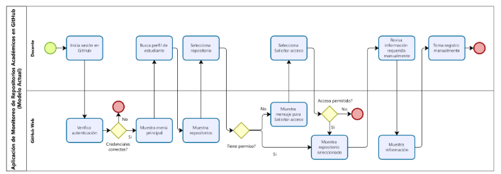
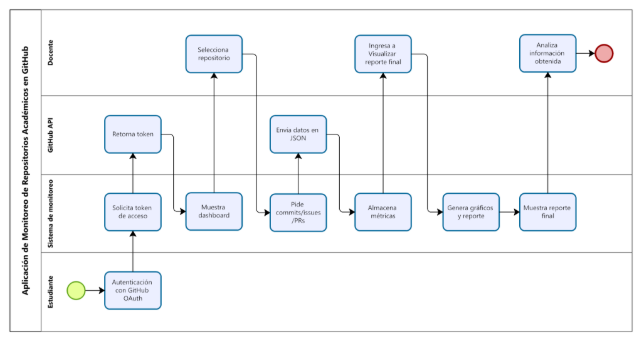
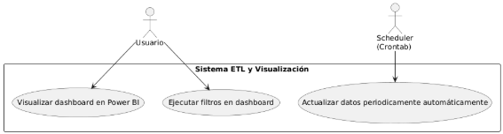
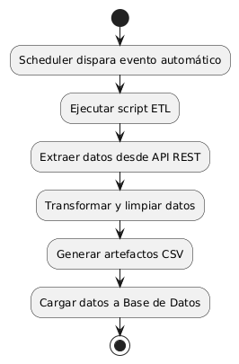
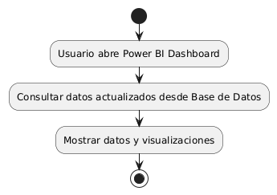
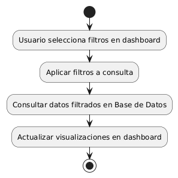
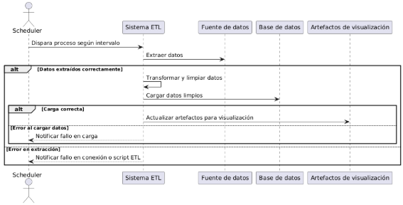
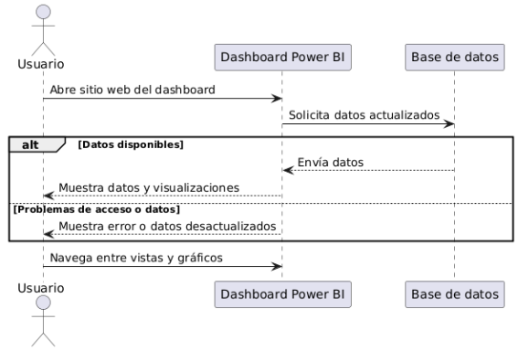
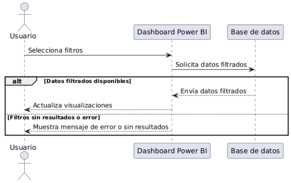
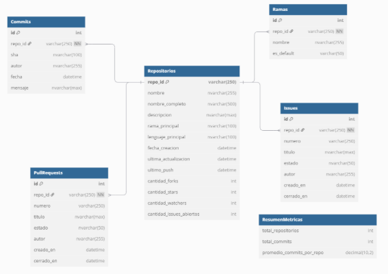

		

**UNIVERSIDAD PRIVADA DE TACNA**

**FACULTAD DE INGENIERÍA**

**Escuela Profesional de Ingeniería de Sistemas**

***Aplicación de Monitoreo de Repositorios Académicos en GitHub: Tendencias en Desarrollo y Gestión de Proyectos de los estudiantes en la facultad de Ingeniería de Sistemas***

Curso: *Inteligencia de Negocios*

Docente: *Patrick Jose Cuadros Quiroga*

Integrantes:

***Chambi Cori Jerson Roni 			(2021072619)***

***Flores Quispe Jaime Elias			(2021070309)***

***Leyva Sardón Elvis Ronald			(2021072614)***

**Tacna – Perú**

***2025***

|CONTROL DE VERSIONES||||||
| :-: | :- | :- | :- | :- | :- |
|Versión|Hecha por|Revisada por|Aprobada por|Fecha|Motivo|
|1\.0|MPV|ELV|ARV|10/10/2020|Versión Original|

***Aplicación de Monitoreo de Repositorios Académicos en GitHub: Tendencias en Desarrollo y Gestión de Proyectos de los estudiantes en la facultad de Ingeniería de Sistemas***

**Documento de Especificación de Requerimientos de Software**

**Versión *{1.0}***

|CONTROL DE VERSIONES||||||
| :-: | :- | :- | :- | :- | :- |
|Versión|Hecha por|Revisada por|Aprobada por|Fecha|Motivo|
|1\.0|MPV|ELV|ARV|10/10/2020|Versión Original|

**ÍNDICE GENERAL**

[INTRODUCCION	](#_heading=h.sdn0gpzatdnt)4

[I. Generalidades de la Empresa	](#_heading=h.kh60ng5od68v)5

`	`[1. Nombre de la Empresa	5](#_heading=h.92yvqciflc5v)

`	`[2. Vision	5](#_heading=h.92yvqciflc5v)

`	`[3. Mision	5](#_heading=h.92yvqciflc5v)

`	`[4. Organigrama	5](#_heading=h.92yvqciflc5v)

[II. Visionamiento de la Empresa	](#_heading=h.kh60ng5od68v)5

`	`[1. Descripcion del Problema	5](#_heading=h.92yvqciflc5v)

`	`[2. Objetivos de Negocios	5](#_heading=h.92yvqciflc5v)

`	`[3. Objetivos de Diseño	5](#_heading=h.92yvqciflc5v)

`	`[4. Alcance del proyecto	5](#_heading=h.92yvqciflc5v)

`	`[5. Viabilidad del Sistema	5](#_heading=h.92yvqciflc5v)

`	`[6. Informacion obtenida del Levantamiento de Informacion	](#_heading=h.92yvqciflc5v)6

[III.  Análisis de Procesos	](#_heading=h.kh60ng5od68v)6

`	`[a) Diagrama del Proceso Actual – Diagrama de actividades	](#_heading=h.92yvqciflc5v)6

`	`[b) Diagrama del Proceso Propuesto – Diagrama de actividades Inicial	](#_heading=h.92yvqciflc5v)7

[IV Especificacion de Requerimientos de Software	](#_heading=h.kh60ng5od68v)7

`	`[a) Cuadro de Requerimientos funcionales Inicial	](#_heading=h.92yvqciflc5v)7

`	`[b) Cuadro de Requerimientos No funcionales	](#_heading=h.92yvqciflc5v)7

`	`[c) Cuadro de Requerimientos funcionales Final	](#_heading=h.92yvqciflc5v)8

`	`[d) Reglas de Negocio	](#_heading=h.92yvqciflc5v)9

[V Fase de Desarrollo	](#_heading=h.kh60ng5od68v)12

`	`[1. Perfiles de Usuario	](#_heading=h.92yvqciflc5v)12

`	`[2. Modelo Conceptual	5](#_heading=h.92yvqciflc5v)

`	`[a) Diagrama de Paquetes	5](#_heading=h.92yvqciflc5v)

`	`[b) Diagrama de Casos de Uso	](#_heading=h.92yvqciflc5v)12

`	`[c) Escenarios de Caso de Uso (narrativa)	](#_heading=h.92yvqciflc5v)14

[    3. Modelo Logico	](#_heading=h.kh60ng5od68v)23

`	`[a) Analisis de Objetos	](#_heading=h.92yvqciflc5v)23

`	`[b) Diagrama de Actividades con objetos	](#_heading=h.92yvqciflc5v)32

	[c) Diagrama de Secuencia	](#_heading=h.92yvqciflc5v)37

`	`[d) Diagrama de Clases	](#_heading=h.92yvqciflc5v)42

[CONCLUSIONES	](#_heading=h.m9tf6e4txssr)46

[RECOMENDACIONES	](#_heading=h.jifcgiwgbxam)46

[BIBLIOGRAFIA	](#_heading=h.re8k4nvllft2)46

[WEBGRAFIA	](#_heading=h.erqgtz1o5jm8)46

1. **Introducción**
1. Nombre de la empresa: Universidad Privada de Tacna
1. Visión: Ser reconocida como la institución líder en formación de ingenieros en el sur del Perú, impulsando la investigación y el uso de tecnologías disruptivas en el ámbito académico y profesional.
1. Misión: Formar profesionales competentes en ingeniería mediante una educación de calidad, integrando herramientas tecnológicas modernas y fomentando la investigación aplicada para contribuir al desarrollo sostenible de la sociedad.
1. Organigrama: 

1. **Visionamiento de la empresa**
1. [Descripción](https://docs.google.com/document/d/1cocHu0mPvBeIb7S2rH6-tFjQ9j77_9KZ/edit?pli=1#heading=h.92yvqciflc5v)[ del Problema](https://docs.google.com/document/d/1cocHu0mPvBeIb7S2rH6-tFjQ9j77_9KZ/edit?pli=1#heading=h.92yvqciflc5v)

   Actualmente, la Escuela Profesional de Ingeniería de Sistemas de la Universidad Privada de Tacna enfrenta los siguientes problemas en la gestión y evaluación de repositorios académicos en GitHub:

- Evaluación manual y subjetiva: Los docentes revisan repositorios de estudiantes de forma individual, lo que consume tiempo y no garantiza uniformidad en la calificación.
- Falta de métricas claras: No existe un sistema automatizado que mida la calidad del código, frecuencia de commits, manejo de ramas o documentación en repositorios.
- Dificultad en detección de malas prácticas: Problemas como commits vacíos, falta de estructura en repositorios o colaboración insuficiente pasan desapercibidos.
- Ausencia de retroalimentación en tiempo real: Los estudiantes no reciben alertas tempranas sobre su desempeño en GitHub.
1. Objetivos de Negocios
- Automatizar la evaluación de repositorios académicos en GitHub, reduciendo en un 50% el tiempo que los docentes dedican a revisiones manuales.
- Estandarizar criterios de calidad para proyectos estudiantiles (buenas prácticas en Git, estructura de repositorios, documentación).
- Generar informes analíticos que permitan identificar tendencias tecnológicas (lenguajes, frameworks) en los proyectos de la facultad.
- Mejorar la transparencia en la evaluación, proporcionando a los estudiantes métricas objetivas sobre su desempeño.	
1. [Objetivos de Diseño](https://docs.google.com/document/d/1cocHu0mPvBeIb7S2rH6-tFjQ9j77_9KZ/edit?pli=1#heading=h.92yvqciflc5v)

   Interfaz dual:

- Para docentes: Dashboard con métricas agregadas por curso/alumno.
- Para estudiantes: Autoevaluación con gráficos de progreso y checklist de buenas prácticas.

`	`Funcionalidades técnicas:

- Extracción diaria de datos vía GitHub API (commits, PRs, releases).
- Motor de análisis con Python (Pandas, NumPy) para calcular:
  - Frecuencia de contribuciones.
  - Uso de issues y etiquetas.
  - Complejidad de código (líneas por archivo).

Seguridad:

- Autenticación con LDAP (credenciales institucionales).
- Cifrado AES-256 para datos sensibles.
1. [Alcance del proyecto](https://docs.google.com/document/d/1cocHu0mPvBeIb7S2rH6-tFjQ9j77_9KZ/edit?pli=1#heading=h.92yvqciflc5v)
|INCLUYE|NO INCLUYE|
| :- | :- |
|- Monitoreo de repositorios públicos/privados (con permisos).|- Análisis de código avanzado (ej: complejidad ciclomática).|
|- Generación de reportes PDF/Excel.|- Integración con otras plataformas (ej: Moodle, Google Classroom).|
|- Dashboards para docentes y estudiantes.|- Gestión de proyectos fuera de GitHub (ej: GitLab, Bitbucket).|
|- Soporte para cursos de la Escuela de Ingeniería de Sistemas.||

1. [Viabilidad del Sistema](https://docs.google.com/document/d/1cocHu0mPvBeIb7S2rH6-tFjQ9j77_9KZ/edit?pli=1#heading=h.92yvqciflc5v)
|Tipo de Viabilidad|Análisis Detallado|Soporte Documental|
| :- | :- | :- |
|Técnica|
- Tecnologías probadas: Python (Flask 2.3), GitHub API v3/v4, MySQL 8.0.

- Compatibilidad: Funciona en Chrome (v115+), Firefox (v110+), Edge (v100+).

- Infraestructura: Hosting en AWS con balanceador de carga (según FD01, sección 4.1).

- Escalabilidad: Diseñado para soportar hasta 500 repositorios simultáneos (FD02, sección 4.3).
|FD01 (4.1 Factibilidad Técnica), FD02 (7. Rangos de Calidad)|
|Operativa|
- Adopción gradual: Piloto con 3 cursos antes de escalar (FD01, sección 4.3).

- Capacitación: 2 talleres (1 para docentes, 1 para estudiantes) de 2 horas cada uno.

- Soporte interno: Equipo de TI de la universidad gestionará mantenimiento (FD01, 3.2 Consideraciones HW/SW).
|FD01 (4.3 Factibilidad Operativa), FD02 (3. Entorno de Usuario)|
|Económica|
- Costos directos: S/11,648 (FD01, 4.2.5). Desglose:

- Desarrollo: S/7,500

- Infraestructura: S/3,338

- Operativos: S/1,350

- Beneficios:

- Ahorro de S/5,000 anuales en horas docentes.

- Reducción del 30% en reprobados por mala gestión de repositorios (FD02, conclusión).
|FD01 (4.2 Factibilidad Económica), FD02 (4.4 Costos y Precios)|
|Legal|
- Protección de datos: Cumple con Ley N° 29733 (Perú) y políticas de GitHub Education.

- Licencias: Software bajo MIT License (código abierto).

- Términos de uso: Acuerdo con la universidad para acceso restringido a datos académicos (FD02, 9.a Estándares Legales).

- Propiedad intelectual: Los repositorios estudiantiles mantienen su licencia original.
|FD01 (4.4 Factibilidad Legal), FD02 (9. Otros Requerimientos)|
|Ambiental|
- Reducción de papel: Elimina informes impresos de evaluación (FD01, 4.6).

- Huella de carbono: Acceso remoto reduce desplazamientos (estimado: 0.8 tCO2eq/año menos).
|FD01 (4.6 Factibilidad Ambiental)|
|Social|
- Impacto educativo: Mejora la empleabilidad de estudiantes (FD02, conclusión).

- Transparencia: Reduce conflictos por calificaciones subjetivas (FD01, 4.5).

- Inclusión: Accesible para estudiantes con discapacidad (WCAG 2.1 AA).
|FD01 (4.5 Factibilidad Social), FD02 (3.6 Necesidades)|

1. [Información obtenida del Levantamiento de Información](https://docs.google.com/document/d/1cocHu0mPvBeIb7S2rH6-tFjQ9j77_9KZ/edit?pli=1#heading=h.92yvqciflc5v)

`	`Encuestas a estudiantes (Muestra: 50):
|Hallazgo|Porcentaje|Implicancia|
| :- | :- | :- |
|Desconocen cómo usar issues para gestión de tareas|68%|Baja trazabilidad en proyectos.|
|No utilizan pull requests para revisiones de código|72%|Colaboración ineficiente.|
|Reciben retroalimentación tardía (2+ semanas)|85%|Oportunidades perdidas de mejora.|
|Interés en aprender buenas prácticas con GitHub|91%|
Alto potencial de adopción.

|

`	`Benchmarking de Soluciones Existentes:
|Herramienta|Ventaja|Limitaciones para el Contexto Académico|
| :- | :- | :- |
|GitPrime|
- Análisis avanzado de contribuciones.

- Dashboards ejecutivos.
|
- Costo: USD $1,500+/mes.

- Enfocado en empresas, no en educación.
|
|Octobox|- Gestión de notificaciones de GitHub.|- No mide calidad de código o documentación.|
|Nuestra Solución|- Adaptada a estándares curriculares.|- Limitada a GitHub.|

[III.  Análisis de Procesos](#_heading=h.kh60ng5od68v)

`	`[a) Diagrama del Proceso Actual – Diagrama de actividades](#_heading=h.92yvqciflc5v)

`	`[b) Diagrama del Proceso Propuesto – Diagrama de actividades Inicial](#_heading=h.92yvqciflc5v)

[**IV Especificacion de Requerimientos de Software**](https://docs.google.com/document/d/1gc-QevnPwya9QKmFrWsLaPkoLAWqCzBn39D2hlpjwWs/edit#heading=h.1fob9te)

`	`[a) Cuadro de Requerimientos funcionales Inicial](https://docs.google.com/document/d/1gc-QevnPwya9QKmFrWsLaPkoLAWqCzBn39D2hlpjwWs/edit#heading=h.3znysh7)

|**ID**|**Requerimiento**|**Descripción**|
| :-: | :-: | :-: |
|RF-01|Autenticación con GitHub|Permitir a los usuarios autenticarse mediante OAuth2 para acceder a los datos de los repositorios.|
|RF-02|Obtención de repositorios|Listar los repositorios académicos de una organización en GitHub.|
|RF-03|Análisis de actividad en repositorios|Extraer y analizar commits, ramas, issues y pull requests para evaluar la actividad de desarrollo.|
|RF-04|Evaluación de calidad del código|Medir complejidad del código, adherencia a estándares y cobertura de pruebas unitarias.|
|RF-05|Identificación de tecnologías|Detectar los lenguajes de programación y frameworks utilizados en cada repositorio.|
|RF-06|Verificación de documentación|Comprobar la presencia de README.md e informes técnicos (.docx, .md).|
|RF-07|Almacenamiento y procesamiento de datos|Guardar los datos obtenidos en una base de datos MySQL para su análisis.|
|RF-08|Cálculo de métricas clave|Generar indicadores de frecuencia de contribución y tendencias de desarrollo.|
|RF-09|Generación de reportes automatizados|Crear reportes en PDF y CSV sobre la actividad y calidad del desarrollo.|
|RF-10|Visualización de datos|Mostrar gráficos interactivos sobre commits, issues, pull requests y tecnologías utilizadas.|
|RF-11|Panel de control administrativo|Implementar un dashboard para consultar y analizar la información de los repositorios.|
|RF-12|Exportación e integración con Power BI|Permitir la exportación de datos e integración con Power BI para análisis avanzado.|

`	`[b) Cuadro de Requerimientos No funcionales](https://docs.google.com/document/d/1gc-QevnPwya9QKmFrWsLaPkoLAWqCzBn39D2hlpjwWs/edit#heading=h.3znysh7)

|**N°**|**REQUERIMIENTO NO FUNCIONAL**|**DESCRIPCIÓN**|**PRIORIDAD**|
| :-: | :-: | :-: | :-: |
|RNF-01|Seguridad|Implementar autenticación OAuth2 con GitHub y cifrado de datos sensibles en la base de datos.|Alta|
|RNF-02|Escalabilidad|Diseñar la base de datos y la API para soportar un alto volumen de repositorios y peticiones simultáneas.|Alta|
|RNF-03|Disponibilidad|Garantizar que la aplicación esté disponible al menos el 99.5% del tiempo con backups y balanceo de carga.|Alta|
|RNF-04|Rendimiento|Optimizar consultas SQL y tiempos de respuesta de la API (máximo 2s por petición).|Alta|
|RNF-05|Usabilidad|Diseñar una interfaz intuitiva con dashboards en Power BI y reportes accesibles para usuarios no técnicos.|Alta|

`	`[c) Cuadro de Requerimientos funcionales Final](https://docs.google.com/document/d/1gc-QevnPwya9QKmFrWsLaPkoLAWqCzBn39D2hlpjwWs/edit#heading=h.3znysh7)

|**N°**|**REQUERIMIENTO FUNCIONAL**|**DESCRIPCIÓN**|**PRIORIDAD**|
| :-: | :-: | :-: | :-: |
|RF-01|Analizar actividad en repositorios|Extraer y presentar datos sobre commits, ramas, issues y pull requests de los repositorios.|Alta|
|RF-02|
Generar métricas de actividad

|Calcular estadísticas sobre la frecuencia de contribuciones, número de issues abiertas/cerradas y actividad en pull requests.|Alta|
|RF-03|Identificar tecnologías utilizadas|Detectar cantidad de lenguajes de programación en los repositorios.|Alta|
|RF-04|Visualizar reportes interactivos de actividad|Mostrar visualizaciones gráficas interactivas con estadísticas y tendencias de desarrollo.|Media|

`	`d) Reglas de Negocio

|**N°**|**Regla de Negocio**|**Descripción**|
| :-: | :-: | :-: |
|RN-01|Autenticación obligatoria con GitHub|Todo usuario debe iniciar sesión mediante el protocolo OAuth2 utilizando su cuenta de GitHub para acceder a las funcionalidades del sistema.|
|RN-02|Acceso controlado a repositorios|El sistema únicamente analizará repositorios públicos o aquellos repositorios privados a los que el usuario autenticado tenga acceso autorizado.|
|RN-03|Rango de análisis configurable|El usuario podrá seleccionar un periodo de tiempo específico para analizar la actividad del repositorio (commits, issues y pull requests).|
|RN-04|Evaluación mínima para análisis|Un repositorio será considerado válido para análisis si contiene al menos un commit y archivos fuente reconocibles (código o documentación).|
|RN-05|Requisitos para evaluación de documentación|Para considerar que un repositorio posee documentación adecuada, debe incluir al menos un archivo README.md y un informe técnico en .docx o .md.|
|RN-06|Identificación automática de tecnologías|El sistema detectará automáticamente los lenguajes y tecnologías utilizados a través del análisis de extensiones y contenidos de los archivos.|
|RN-07|Generación periódica de reportes y visualizaciones|Los reportes y dashboards se generarán de manera inmediata cuando el usuario lo solicite, o de forma automática cada 24 horas si se activa el monitoreo.|

V Fase de Desarrollo	

1\. Perfiles de Usuario\
2\. Modelo Conceptual		a) Diagrama de Paquetes\
\
\

`	`b) Diagrama de Casos de Uso		

\
`	`c) Escenarios de Caso de Uso (narrativa)	

Caso de Uso: Actualizar datos periódicamente automáticamente

|**Elemento**|**Descripción**|
| :-: | :-: |
|**Actor**|Scheduler (Crontab)|
|**Descripción**|El sistema ETL realiza una actualización automática de los datos periódicamente sin intervención humana.|
|**Flujo básico**|1\. El Scheduler dispara el proceso según el intervalo. 2\. Se ejecuta el script ETL para extraer datos. 3\. Los datos se transforman y limpian. 4\. Se cargan en la base de datos. 5\. Se actualizan los artefactos para visualización.|
|**Excepciones**|- Fallos en la conexión a la fuente de datos.- Error en el script ETL.- Problemas al cargar datos en la base.|

Caso de Uso: Visualizar dashboard en Power BI

|**Elemento**|**Descripción**|
| :-: | :-: |
|**Actor**|Usuario|
|**Descripción**|El usuario accede al dashboard para consultar datos y obtener insights actualizados.|
|**Flujo básico**|1\. Abre el sitio web del dashboard. 2\. El sistema muestra datos actualizados.3. Navega entre vistas y gráficos.|
|**Excepciones**|- Problemas de acceso a la plataforma Power BI.- Datos desactualizados.|

Caso de Uso: Ejecutar filtros en dashboard

|**Elemento**|**Descripción**|
| :-: | :-: |
|**Actor**|Usuario|
|**Descripción**|El usuario aplica filtros para analizar datos específicos en el dashboard.|
|**Flujo básico**|1\. Selecciona filtros. 2\. El sistema actualiza las visualizaciones. 3\. Observa datos filtrados.|
|**Excepciones**|- Filtros que no devuelven resultados.- Errores o demora en la interfaz.|

3\. Modelo Logico	

`	`a) Analisis de Objetos

`	`C**aso de Uso 1: Actualizar datos periódicamente automáticamente**

- **Objetos de Negocio**\

  - Scheduler: Responsable de disparar el evento de actualización de manera automática y periódica.
  - ETLManager: Encargado de ejecutar el proceso ETL que incluye la extracción, transformación, y carga de datos.
- **Objetos de Datos**\

  - FuenteDatosAPI: Representa el origen externo desde donde se extraen los datos vía API REST.
  - RepositorioDatos: Maneja el almacenamiento temporal de artefactos como archivos CSV generados durante el proceso ETL.
  - BaseDatos: Base de datos donde se cargan y almacenan los datos transformados.
-----
### **Caso de Uso 2: Visualizar dashboard en Power BI**
- **Objetos de Presentación**\

  - Dashboard: Representa la interfaz visual que muestra los datos y reportes actualizados al usuario final.
- **Objetos de Datos**\

  - BaseDatos: Fuente principal de datos consultada por el dashboard para presentar la información.
-----
### **Caso de Uso 3: Ejecutar filtros en dashboard**
- **Objetos de Presentación**\

  - Dashboard: Interfaz que permite mostrar y actualizar visualizaciones basadas en los filtros aplicados.
  - Filtro: Elemento que gestiona la selección y aplicación de filtros sobre los datos mostrados.
- **Objetos de Datos**\

  - BaseDatos: Permite consultas específicas con criterios y filtros aplicados para entregar datos segmentados al dashboard.

`	`b) Diagrama de Actividades con objetos

Caso de Uso: Actualizar datos periódicamente automáticamente

Caso de Uso: Visualizar dashboard en Power BI

Caso de Uso: Ejecutar filtros en dashboard

	[c) Diagrama de Secuencia](https://docs.google.com/document/d/1gc-QevnPwya9QKmFrWsLaPkoLAWqCzBn39D2hlpjwWs/edit#heading=h.3znysh7)

Diagrama de Secuencia para Analizar actividad en repositorios

Diagrama de Secuencia para: Actualizar datos periódicamente automáticamente

Diagrama de Secuencia para: Visualizar dashboard en Power BI

Diagrama de Secuencia para: Ejecutar filtros en dashboard

	[d) Diagrama de Clases](https://docs.google.com/document/d/1gc-QevnPwya9QKmFrWsLaPkoLAWqCzBn39D2hlpjwWs/edit#heading=h.3znysh7)

[CONCLUSIONES](https://docs.google.com/document/d/1gc-QevnPwya9QKmFrWsLaPkoLAWqCzBn39D2hlpjwWs/edit#heading=h.2et92p0)

Este tema representa un avance en la modernización de los procesos educativos de la Facultad de Ingeniería de Sistemas. Al automatizar la evaluación de repositorios estudiantiles, no solo se optimiza el tiempo de los docentes, sino que también se introduce transparencia y objetividad en la calificación de proyectos. La herramienta desarrollada, con su capacidad para facilitar el  análisis de commits, issues, pull requests y documentación, proporciona métricas claras que ayudan a identificar tanto fortalezas como áreas de mejora en el trabajo de los estudiantes.

Además, se fomenta mejores prácticas de desarrollo entre los alumnos, alineando su formación con los estándares de la industria tecnológica. La integración con GitHub API y el uso de tecnologías como Python, Streamlit y Power BI aseguran que la solución sea escalable y adaptable a futuras necesidades.

En el futuro, sería valioso expandir esta herramienta para incluir análisis de código más avanzados y soporte para otras plataformas como GitLab, manteniendo siempre el enfoque en la mejora continua y la relevancia educativa. Este proyecto no solo resuelve un problema inmediato, sino que sienta las bases para un enfoque más data-driven en la evaluación académica, beneficiando a estudiantes, docentes y la institución en su conjunto.

[RECOMENDACIONES](https://docs.google.com/document/d/1gc-QevnPwya9QKmFrWsLaPkoLAWqCzBn39D2hlpjwWs/edit#heading=h.tyjcwt)

- Implementar talleres periódicos para estudiantes y docentes sobre el uso eficiente de GitHub, enfocados en gestión de branches, creación de pull requests significativos y documentación adecuada. Esto asegurará que los datos recopilados reflejen un uso consciente de la plataforma y no solo actividad superficial.
- Conectar el sistema de monitoreo con LMS como Moodle o Classroom mediante APIs, para centralizar la información académica. Esto permitiría vincular automáticamente las métricas de GitHub con calificaciones o retroalimentación formativa en los cursos.
- Más allá de commits individuales, priorizar métricas que midan trabajo en equipo: revisión de pares (PRs comentados), resolución conjunta de issues y commits coautorados. Estos datos ayudarían a evaluar habilidades blandas críticas en entornos laborales reales.
- Establecer políticas claras sobre privacidad y propiedad intelectual, especialmente para repositorios privados. Incluir opciones de exclusión voluntaria y mecanismos de anonimización para proteger a estudiantes que desarrollen proyectos con información confidencial.

