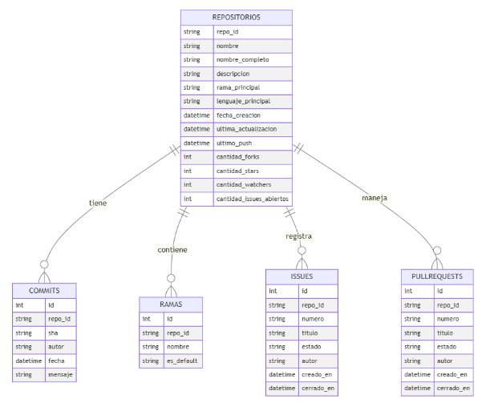
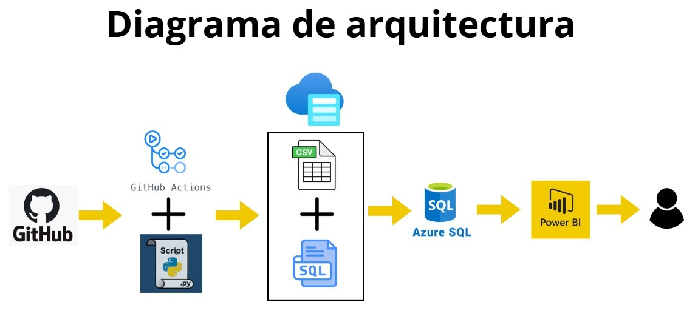
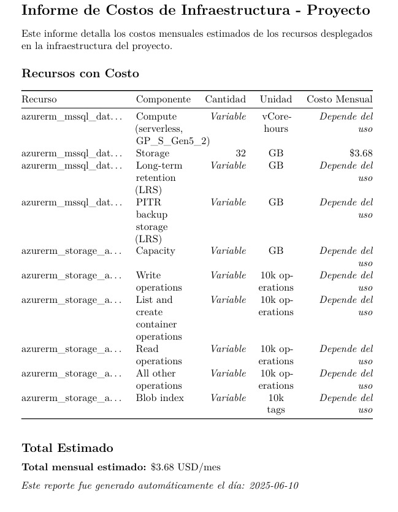

# 📊 Dashboard de Monitoreo para Repositorios Académicos en GitHub: Tendencias en Desarrollo y Gestión de Proyectos de los Estudiantes en la Facultad de Ingeniería de Sistemas

**Integrantes:**  
  - Jerson Roni Chambi Cori  
  - Jaime Elías Flores Quispe  
  - Elvis Ronald Leyva Sardón  

---

# 🚨 Problemática: "Dificultades en el Monitoreo y Gestión de Proyectos Académicos en GitHub"

## 📚 *Contexto*  
En la Escuela Profesional de Ingeniería de Sistemas, los proyectos académicos en GitHub carecen de una estructura organizada y de buenas prácticas de gestión, lo que dificulta su seguimiento, evaluación y colaboración efectiva.

---

## ⚠️ *Problemática*  

1. **Monitoreo de actividad:** Falta de visibilidad sobre commits, ramas e integraciones.  
2. **Gestión de versiones:** Uso inconsistente de ramas y estrategias de integración.  
3. **Tecnologías utilizadas:** Falta de homogeneidad en lenguajes y herramientas.  
4. **Gestión de tareas e incidencias:** Baja adopción de issues y pull requests para el control del trabajo.  
5. **Visualización:** Carencia de herramientas que faciliten el análisis y comparación de proyectos.

---

# 🎯 Objetivo General

Diseñar e implementar un Dashboard interactivo que permita monitorear y analizar la actividad en repositorios académicos de GitHub, mediante la recopilación y visualización de métricas como la frecuencia y gestión de ramas, commits, issues, pull requests y tecnologías utilizadas, con el objetivo de evaluar la productividad, participación y organización en el desarrollo colaborativo.

---

## 🎯 Objetivos Específicos

1. **Analizar la estructura y dinámica de las ramas en los repositorios**
   - Medir la frecuencia de creación de ramas.
   - Identificar las ramas predeterminadas en cada repositorio.
   - Calcular el total de ramas por repositorio.

2. **Evaluar la actividad y el desempeño en los repositorios**
   - Elaborar un ranking de commits por repositorio.
   - Identificar las fechas y meses con mayor cantidad de commits.
   - Analizar la tendencia de commits por mes.
---

3. **Monitorear la tendencia de desarrollo según el lenguaje de programación**
   - Identificar los lenguajes de programación predominantes y su evolución en el tiempo.

4. **Comparar la actividad global entre repositorios**
   - Realizar comparativas generales considerando la cantidad de commits, issues y pull requests por repositorio.
---

5. **Identificar y reconocer la participación de los usuarios**
   - Generar un ranking de usuarios con más commits.
   - Generar un ranking de usuarios con mayor número de contribuciones (commits + issues + pull requests).

6. **Detectar los repositorios con mayor actividad colaborativa**
   - Generar un ranking de repositorios considerando la suma total de commits, issues y pull requests.

---

## 📌 Diagrama de base de datos

---

## 📌 Infraestructura

---

## 📌 Costos
