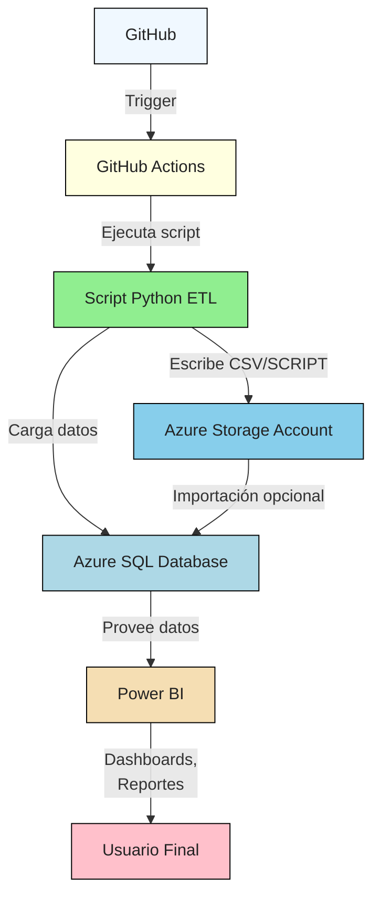
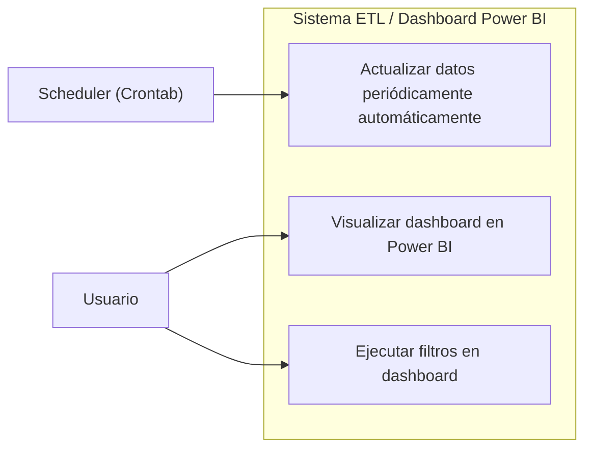
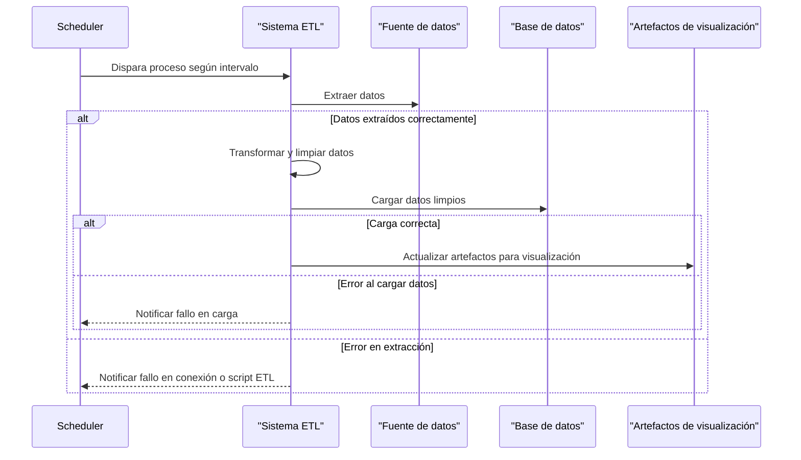
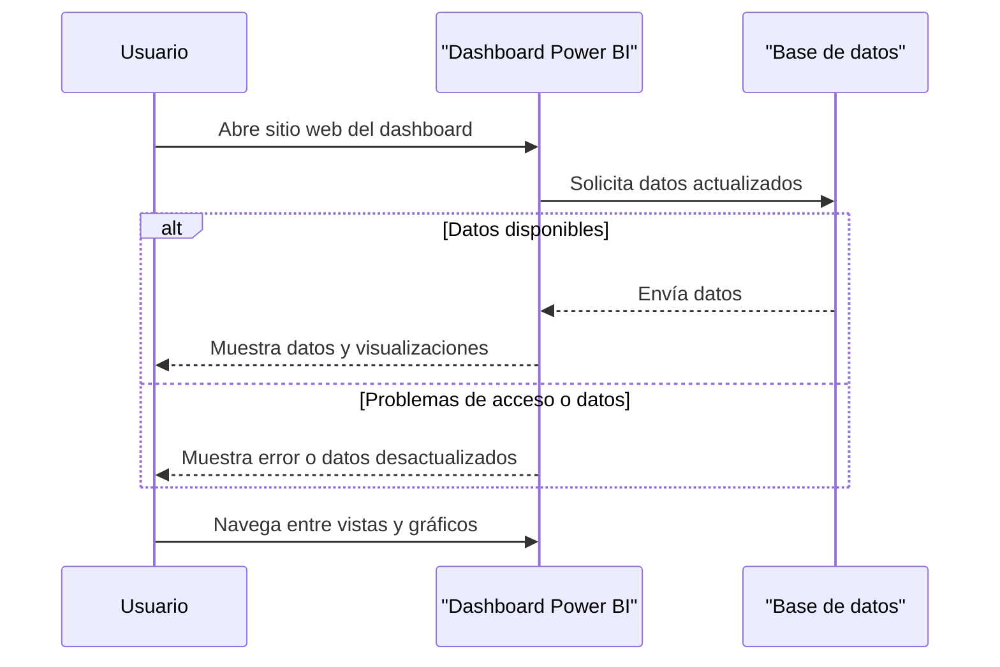
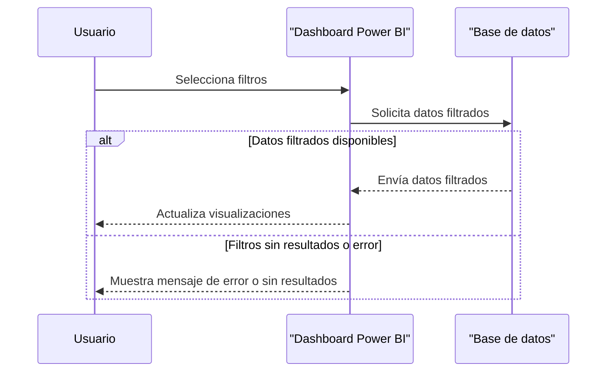

# 🎓 Universidad Privada de Tacna
# CURSO: INTELIGENCIA DE NEGOCIOS
## 👨‍🎓 Alumnos
- **Jerson Roni Chambi Cori**
- **Jaime Elias Flores Quispe**
- **Elvis Ronald Leyva Sardon**

# Dashboard de Monitoreo de Repositorios Académicos en GitHub

Sistema para la **evaluación automática y monitoreo** de repositorios académicos de estudiantes de la Facultad de Ingeniería de Sistemas, Universidad Privada de Tacna. Facilita el análisis de métricas de contribución, calidad del código, uso de buenas prácticas y tecnologías empleadas, además de proveer dashboards y reportes para docentes y estudiantes.

---

## Descripción General

Esta herramienta automatiza la revisión de repositorios GitHub usados en cursos académicos, permitiendo:

- **Reducción del tiempo de evaluación docente**.
- **Estandarización de buenas prácticas** en el desarrollo.
- **Reportes analíticos** y métricas objetivas de desempeño.
- **Transparencia y retroalimentación** inmediata para estudiantes.

---

## Objetivos

- **Automatizar** la evaluación de repositorios, reduciendo el tiempo de revisión manual.
- **Estandarizar** criterios de calidad y buenas prácticas en el desarrollo de software.
- **Generar reportes** e identificar tendencias tecnológicas en los proyectos estudiantiles.
- **Mejorar la transparencia** y objetividad en la calificación.

---

## Funcionalidades Principales

- Autenticación con GitHub (OAuth2).
- Extracción y análisis de commits, ramas, issues, pull requests.
- Cálculo automático de métricas de actividad y tecnologías usadas.
- Dashboards interactivos y reportes exportables (PDF/CSV).
- Integración con Power BI.
- Verificación automática de documentación (README.md, informes técnicos).

---

## Requerimientos Funcionales

| ID     | Requerimiento                               | Descripción                                                                 | Prioridad |
|--------|---------------------------------------------|-----------------------------------------------------------------------------|-----------|
| RF-01  | Analizar actividad en repositorios          | Extraer y presentar datos sobre commits, ramas, issues y pull requests.     | Alta      |
| RF-02  | Generar métricas de actividad               | Calcular estadísticas sobre frecuencia de contribución y actividad.         | Alta      |
| RF-03  | Identificar tecnologías utilizadas          | Detectar lenguajes de programación y frameworks en los repositorios.        | Alta      |
| RF-04  | Visualizar reportes interactivos de actividad| Mostrar gráficos y tendencias de desarrollo.                                | Media     |

---

## Diagramas en Mermaid

### Diagrama de Arquitectura

---

### Diagrama de Casos de Uso

---

### Diagrama de Secuencia

---

## Reglas de Negocio

- Solo se analizan repositorios públicos de la organizacion con permisos autorizados.
- El usuario puede seleccionar un filtro de año y mes para el análisis.
- Para ser considerado válido, un repositorio debe tener al menos un commit y archivos fuente/documentación.
- Debe existir un archivo `README.md` y al menos un informe técnico (.docx o .md).
- La detección de tecnologías se realiza automáticamente.

---

## Recomendaciones

- Mantener el `README.md` actualizado y con enlaces a los diagramas Mermaid.
- Garantizar la existencia de documentación técnica y archivos requeridos en cada repositorio monitoreado.
- Incentivar el uso de issues y pull requests para mejorar la colaboración y trazabilidad.
- Implementar talleres periódicos sobre buenas prácticas en GitHub para estudiantes y docentes.
- Considerar la integración futura con LMS como Moodle para centralizar la información académica.

---

# ENLACE DE DASHBOARD

https://app.powerbi.com/links/VtN9HA7oPn?ctid=b6b466ee-468d-4011-b9fc-fbdcf82ac90a&pbi_source=linkShare

