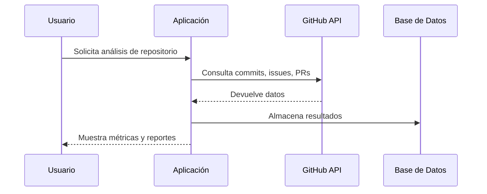

CURSO: INTELIGENCIA DE NEGOCIOS

Integrantes:

Chambi Cori Jerson Roni 			(2021072619)

Flores Quispe Jaime Elias			(2021070309)

Leyva Sardón Elvis Ronald			(2021072614)


# Aplicación de Monitoreo de Repositorios Académicos en GitHub

Sistema para la **evaluación automática y monitoreo** de repositorios académicos de estudiantes de la Facultad de Ingeniería de Sistemas, Universidad Privada de Tacna. Facilita el análisis de métricas de contribución, calidad del código, uso de buenas prácticas y tecnologías empleadas, además de proveer dashboards y reportes para docentes y estudiantes.

---

## Tabla de Contenido

- [Descripción General](#descripción-general)
- [Objetivos](#objetivos)
- [Funcionalidades Principales](#funcionalidades-principales)
- [Requerimientos Funcionales](#requerimientos-funcionales)
- [Diagramas en Mermaid](#diagramas-en-mermaid)
    - [Diagrama de Arquitectura](#diagrama-de-arquitectura)
    - [Diagrama de Casos de Uso](#diagrama-de-casos-de-uso)
    - [Diagrama de Secuencia](#diagrama-de-secuencia)
- [Reglas de Negocio](#reglas-de-negocio)
- [Recomendaciones](#recomendaciones)

---

## Descripción General

Esta herramienta automatiza la revisión de repositorios GitHub usados en cursos académicos, permitiendo:

- **Reducción del tiempo de evaluación docente**.
- **Estandarización de buenas prácticas** en el desarrollo.
- **Reportes analíticos** y métricas objetivas de desempeño.
- **Transparencia y retroalimentación** inmediata para estudiantes.

---

## Objetivos

- **Automatizar** la evaluación de repositorios, reduciendo el tiempo de revisión manual.
- **Estandarizar** criterios de calidad y buenas prácticas en el desarrollo de software.
- **Generar reportes** e identificar tendencias tecnológicas en los proyectos estudiantiles.
- **Mejorar la transparencia** y objetividad en la calificación.

---

## Funcionalidades Principales

- Autenticación con GitHub (OAuth2).
- Extracción y análisis de commits, ramas, issues, pull requests.
- Cálculo automático de métricas de actividad y tecnologías usadas.
- Dashboards interactivos y reportes exportables (PDF/CSV).
- Integración con Power BI.
- Verificación automática de documentación (README.md, informes técnicos).

---

## Requerimientos Funcionales

| ID     | Requerimiento                               | Descripción                                                                 | Prioridad |
|--------|---------------------------------------------|-----------------------------------------------------------------------------|-----------|
| RF-01  | Analizar actividad en repositorios          | Extraer y presentar datos sobre commits, ramas, issues y pull requests.     | Alta      |
| RF-02  | Generar métricas de actividad               | Calcular estadísticas sobre frecuencia de contribución y actividad.         | Alta      |
| RF-03  | Identificar tecnologías utilizadas          | Detectar lenguajes de programación y frameworks en los repositorios.        | Alta      |
| RF-04  | Visualizar reportes interactivos de actividad| Mostrar gráficos y tendencias de desarrollo.                                | Media     |

---

## Diagramas en Mermaid

### Diagrama de Arquitectura

```mermaid
graph TD
    A[Usuario (Docente/Estudiante)] -->|OAuth2| B[Aplicación de Monitoreo]
    B -->|API GitHub| C[GitHub]
    B -->|Datos| D[Base de Datos MySQL]
    B -->|Dashboards| E[Power BI]
    B -->|Reportes| F[PDF/CSV]
    B -->|Analítica| G[Motor Python ETL]
```

---

### Diagrama de Casos de Uso

```mermaid
usecaseDiagram
    actor Docente
    actor Estudiante
    Docente --> (Ver dashboard de curso)
    Docente --> (Exportar reportes)
    Estudiante --> (Ver progreso personal)
    Estudiante --> (Recibir retroalimentación)
    (Ver dashboard de curso) --> (Analizar métricas de repositorio)
    (Ver progreso personal) --> (Checklist de buenas prácticas)
```

---

### Diagrama de Secuencia



---

## Reglas de Negocio

- Todo usuario debe iniciar sesión mediante OAuth2 con su cuenta de GitHub.
- Solo se analizan repositorios públicos o privados con permisos autorizados.
- El usuario puede seleccionar un rango temporal para el análisis.
- Para ser considerado válido, un repositorio debe tener al menos un commit y archivos fuente/documentación.
- Debe existir un archivo `README.md` y al menos un informe técnico (.docx o .md).
- La detección de tecnologías se realiza automáticamente.
- Los reportes y dashboards se generan bajo demanda o cada 24 horas si el monitoreo está activo.

---

## Recomendaciones

- Mantener el `README.md` actualizado y con enlaces a los diagramas Mermaid.
- Garantizar la existencia de documentación técnica y archivos requeridos en cada repositorio monitoreado.
- Incentivar el uso de issues y pull requests para mejorar la colaboración y trazabilidad.
- Implementar talleres periódicos sobre buenas prácticas en GitHub para estudiantes y docentes.
- Considerar la integración futura con LMS como Moodle para centralizar la información académica.

---
